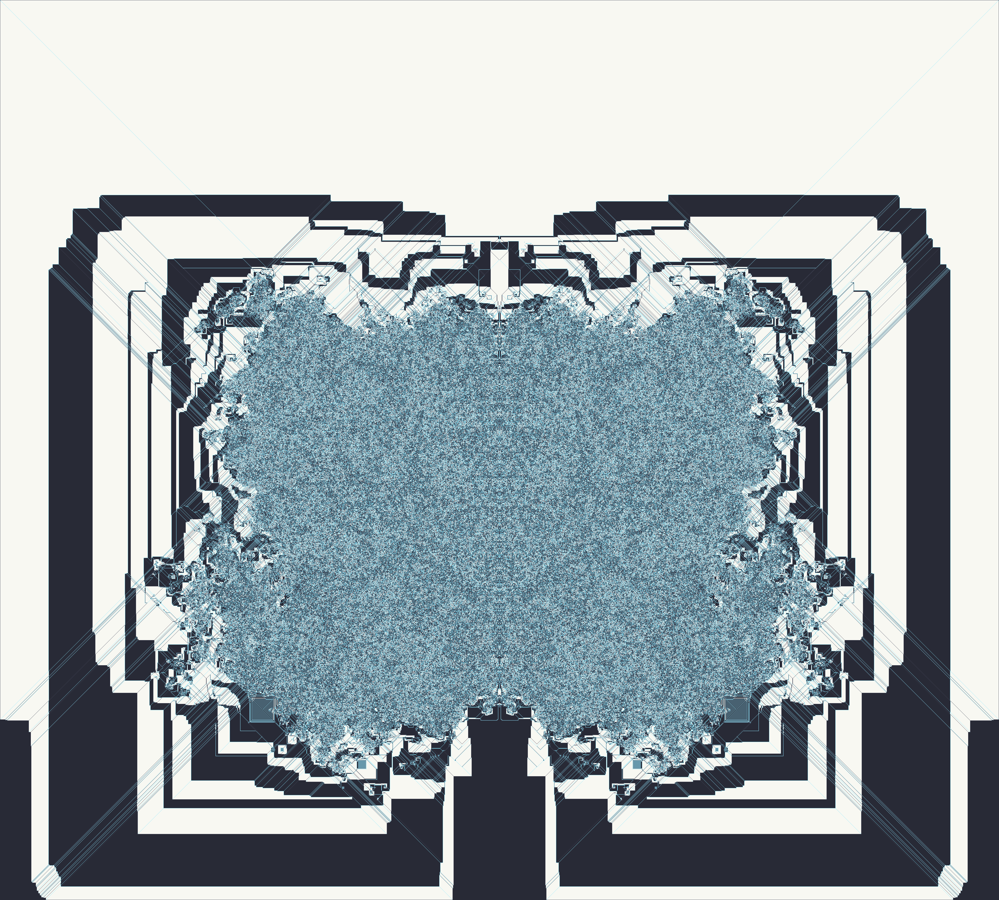
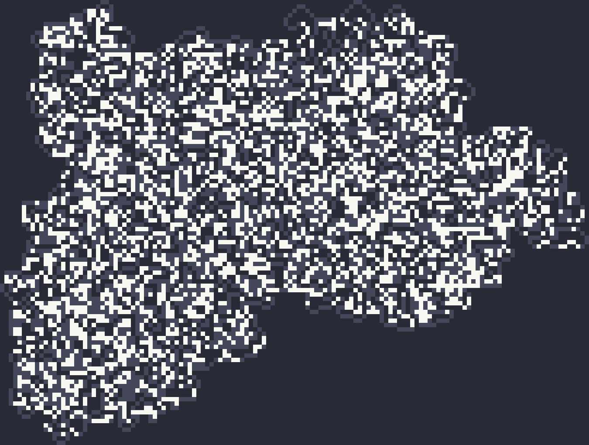

# 2D (and 1D) turing machines

## Langton's Ants:

#### LRRL:

#### RRLLLRLLLRRR:

#### LRRRRRLLR:

#### LLRR:

#### RLR:

## TODO:

- [x] Máquina 2d
- [ ] Encontrar paleta melhor
- [ ] Desempenho (Data.MVector)
- [ ] Geração direto para PNG
- [ ] Máquina nd (?)
